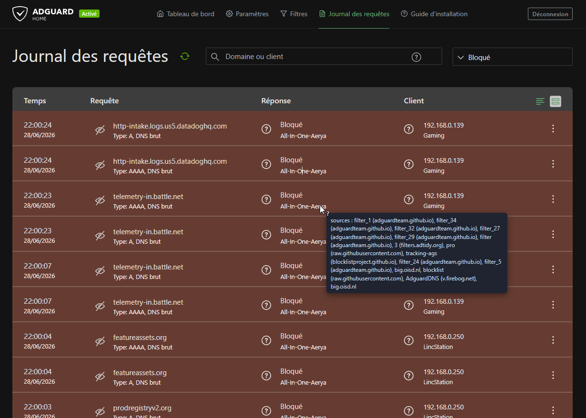

# Userscript — Provenance dans le journal d'AdGuard Home

Affiche, pour chaque domaine bloqué dans le journal d'AdGuard Home, la ou les
**listes sources d'origine**, en interrogeant l'index de provenance (shards JSON
servis par GitHub Pages).



> Utile uniquement si ton AGH charge la **liste unifiée** de ce dépôt : les
> shards traduisent *les règles de cette liste* → *leurs sources amont*.

## Comment ça marche

```
Navigateur (journal AGH)
   userscript  --(fnv1a32(domaine) -> shard)-->  GitHub Pages : shards/<n>.json
   puis injecte « sources : EasyList, HaGeZi Pro » sur la ligne
```

- Le domaine est lu directement dans la ligne du journal (pas d'appel à l'API AGH).
- Une seule petite requête par shard, mise en cache (RAM bornée + cache navigateur).
- **Toi, tu n'héberges rien et tu ne lances aucun script** : les shards sont
  produits et publiés par le workflow `update.yml` (GitHub Actions), chaque jour.

## Mise en place

### 1. Côté dépôt (une seule fois)

- Activer GitHub Pages : **Settings → Pages → Source = "GitHub Actions"**.
- Lancer le workflow (`Actions → Update AdGuard List → Run workflow`, ou attendre
  le run quotidien). Il génère et publie `index.json` + `shards/` sur Pages.
- Vérifier que `https://aerya.github.io/AdGuardFilters-pour-iOS/index.json` répond.

### 2. Côté navigateur

- Installer le userscript `userscript/adgh-provenance.user.js` dans
  Tampermonkey/Violentmonkey.
- Vérifier dans le bloc `CONFIG` :
  - `BASE_URL` → l'URL Pages (par défaut `https://aerya.github.io/AdGuardFilters-pour-iOS/`).
  - `@match` (en-tête) → l'URL de ton AGH (par défaut `http://192.168.0.64/*`).
- Ouvrir le **journal des requêtes** d'AGH, filtre « Bloqué ». Les lignes dont le
  domaine est dans l'index reçoivent un badge `sources : …`.

## Tester avant de partager le userscript

Le **userscript** n'a pas besoin d'être publié pour être testé : tu l'installes
en local et il interroge la Pages (qui, elle, ne contient que des données
publiques : domaine → nom de liste). Tu valides, puis tu décides de partager le
`.user.js` ou non.

### Si rien ne s'affiche

Active `DEBUG: true` dans `CONFIG` et regarde la console (F12) :
- « lignes trouvées : 0 » → le `ROW_SELECTOR` ne correspond pas au markup de ta
  version d'AGH. Inspecte une ligne et ajuste `ROW_SELECTOR`.
- « domaine … » mais pas de badge → domaine hors index (règle exotique : joker,
  regex, exception `@@`) ou shard 404.
- Erreur réseau → `BASE_URL` injoignable ou `@connect` à élargir.

## Limites

- Index par **domaine** : ne couvre pas les jokers, regex, `$modifiers` complexes
  ni les exceptions `@@`. Ce n'est pas une simulation du moteur AdGuard.
- L'index reflète l'état au dernier build (`collected_at` dans `index.json`).
